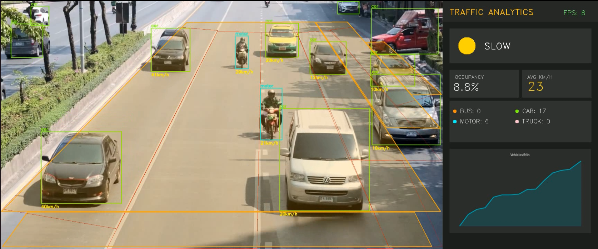

<div align="center">

# Real-Time Traffic Flow Analysis &amp; Vehicle Speed Estimation

**Turns one fixed road camera's RTSP stream into per-vehicle speed in km/h, road occupancy as a percentage of a hand-calibrated ROI, and a seven-state congestion label, rendered live on an OpenCV dashboard.**


</div>

---

## Overview

Manual traffic monitoring does not scale, and congestion decisions need numbers while the congestion is happening. This project produces three of them from a single camera: vehicle counts by class, movement speed in km/h, and how much of the road surface is occupied. Detection is a YOLOv8s model fine-tuned on four Vietnamese traffic classes; tracking is ByteTrack; speed comes from a per-zone homography rather than pixel displacement.

> [!NOTE]
> Course project for CS311.Q11 (AI Programming Techniques). It analyses one fixed camera at a time. Speed and occupancy zones are hand-aligned point by point in `traffic_config.json` and are only valid for the camera angle they were drawn on. Scope is flow analysis: there is no plate recognition, so individual vehicles are not identified.



<p align="center">
  <a href="https://www.youtube.com/watch?v=4xJBgZlyf8E">
    
  </a>
</p>

The capture predates the current chart panel, which now plots the occupancy trend.

## Pipeline

```text
RTSP stream
   └─▶ Threaded capture      (producer-consumer, queue maxsize=10, drop-oldest, TCP transport)
         └─▶ YOLOv8s detection + ByteTrack tracking
               ├─▶ Speed estimator      (per-zone homography → EMA filter)
               ├─▶ Occupancy calculator (Σ vehicle footprint / ROI area)
               └─▶ Traffic analytics    (rolling means → state rules → trend chart)
                     └─▶ Dashboard renderer (OpenCV overlay + Matplotlib Agg)
```

| Thread | Owns | Behaviour |
|---|---|---|
| Capture | RTSP connection, frame queue | Discards the oldest frame when the queue is full; RTSP transport forced to TCP |
| Main | Model, tracker state, analytics buffers, display | Consumes one frame per iteration, 1 s read timeout |

## Method

### Detection and tracking — `traffic4.pt`, `my_tracker.yaml`

| Role | Choice | Fallback when the file is absent |
|---|---|---|
| Detector | `traffic4.pt` — YOLOv8s fine-tuned on `bus`, `car`, `motor`, `truck` | Stock `yolov8n.pt`, which does not carry these four classes |
| Tracker | `my_tracker.yaml` — ByteTrack association parameters | Ultralytics stock `bytetrack.yaml` |
| Inference call | `model.track(persist=True, conf=0.25)` | — |

Counting is per unique track ID on first entry into an occupancy ROI.

### Speed — per-zone homography

1. Each speed zone in `traffic_config.json` supplies four pixel points plus the real width and length of the rectangle they map to; `cv2.getPerspectiveTransform` builds one matrix per zone.
2. The bounding box's bottom-centre is taken as the ground contact point.
3. That point is mapped to metres and differenced against its previous mapped position over wall-clock time.
4. Track history is deleted when a vehicle leaves every zone, and reset when it crosses into a different zone.

| Guard | Value |
|---|---|
| Minimum time delta | `Δt > 0.02 s` |
| Minimum track age | `> 5` frames |
| Outlier rejection | `> 100 km/h` holds the previous value |
| Smoothing | `v = 0.9·v_prev + 0.1·v_new` |

### Occupancy and traffic state

- Occupancy is the sum of nominal per-class real footprints for vehicles inside the ROI polygons, divided by the total real area of those polygons, capped at 100 %.
- Footprints are fixed per class in `VEHICLE_REAL_AREAS` (`main.py`), so a compact car and a large SUV contribute the same area.
- The displayed state is evaluated on rolling means — the last 50 speed samples above 5 km/h and the last 30 occupancy samples. First matching rule wins.

| Condition | State |
|---|---|
| No vehicles in ROI, occupancy < 1 % | Empty Road |
| Speed < 5 km/h, occupancy > 15 % | Stopped / Red Light |
| Occupancy > 45 %, speed < 20 km/h | Traffic Jam |
| Occupancy > 45 % | High Density |
| Speed < 25 km/h | Slow Traffic |
| Occupancy > 15 % | Moderate |
| otherwise | Free Flow |

## Results

| mAP50 | mAP50-95 | Precision | Recall |
|---|---|---|---|
| 0.953 | 0.742 | 0.903 | 0.921 |

> Read from the validation metrics stored inside `traffic4.pt` (50 epochs, `imgsz=640`, `batch=16`, Ultralytics 8.3.204, checkpoint dated 2025-11-30). The training set is not distributed with this repository, so these figures carry no image or instance denominator here. Behaviour in heavy rain, fog and severe occlusion is unmeasured.

| Runtime | Value |
|---|---|
| End-to-end throughput | ~7–9 FPS |
| Display resolution | 1730 × 720 |
| Host hardware | `<RUNTIME_HARDWARE>` |

> Throughput is read from the on-screen FPS counter, not from an instrumented benchmark. Sampling the committed recording `output/run35/analytics_TestVideo1.mp4` at eleven points gives 7–8. The host was not recorded, so the figure is not comparable across machines.

## Requirements

| Requirement | Notes |
|---|---|
| Python | Not pinned anywhere in the repository: `<PYTHON_VERSION>` |
| Packages | `ultralytics`, `opencv-python`, `numpy`, `matplotlib` |
| GPU | Optional; Ultralytics selects CUDA when it is available |
| Weights | `traffic4.pt` at the repository root |
| RTSP source | `tools/mediamtx.exe` is committed and is a Windows build; FFmpeg is not committed |

## Quick start

> [!WARNING]
> `main.py` loads the calibration stored under the literal key `"TestVideo3.mp4"`, whatever the stream actually carries. Publish that video, or change the key in the `load_config_from_json` call, or add a matching entry to `traffic_config.json`. `test.py` is the same pipeline pinned to `"TestVideo1.mp4"`.

```bash
git clone https://github.com/NithanNguyen/traffic_analysis.git && cd traffic_analysis
pip install ultralytics opencv-python numpy matplotlib
cd tools && ./mediamtx.exe                                          # terminal 1
ffmpeg -re -stream_loop -1 -i <VIDEO>.mp4 -c:v copy -rtsp_transport tcp -f rtsp rtsp://localhost:8554/live_stream   # terminal 2
python main.py                                                      # terminal 3
```

Press `q` in the display window to exit.

## Repository structure

```
traffic_analysis/
├── main.py               # Entry point: threaded RTSP capture → track → analytics → dashboard
├── test.py               # Same pipeline, pinned to the "TestVideo1.mp4" calibration key
├── traffic4.pt           # Fine-tuned YOLOv8s weights, 4 classes
├── traffic_config.json   # Speed and occupancy zone geometry, keyed by video filename
├── my_tracker.yaml       # ByteTrack association parameters
├── LICENSE               # MIT
├── assets/images/        # Dashboard capture used above
└── tools/                # MediaMTX Windows binary and its default configuration
```

## Authors

Nguyễn Hoàng An · Nguyễn Phạm Thiên Ân · Phan Tiến Đạt — CS311.Q11, AI Programming Techniques.

## Acknowledgements

Built on [Ultralytics YOLOv8](https://github.com/ultralytics/ultralytics), [ByteTrack](https://github.com/ifzhang/ByteTrack), [OpenCV](https://opencv.org/) and [MediaMTX](https://github.com/bluenviron/mediamtx).

## License

- This repository's source is released under the MIT License; see [`LICENSE`](LICENSE).
- The `traffic4.pt` checkpoint was produced with Ultralytics, whose metadata it carries and which is distributed under AGPL-3.0 — check [Ultralytics licensing](https://www.ultralytics.com/license) before reusing the weights.
